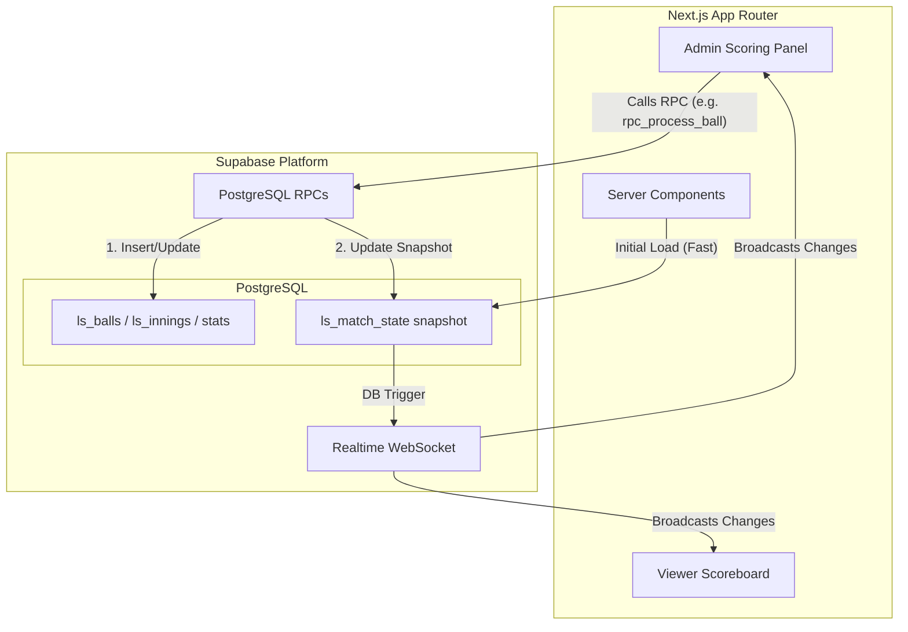

# Live Scoring Architecture Refactor Proposal

This document outlines the architectural improvements to make the live scoring platform extremely fast, scalable, and reliable for handling rapid scoring inputs and many simultaneous viewers.

## 1. Architecture Diagram



## 2. Updated Database Schema Changes

The `ls_match_state` table will serve as the single source of truth for the live UI, preventing heavy aggregations. We will enhance it to include denormalized summary data and a timeline of recent events.

```sql
-- 1. Enhance Match State Snapshot Architecture
ALTER TABLE public.ls_match_state 
ADD COLUMN IF NOT EXISTS total_runs INTEGER NOT NULL DEFAULT 0,
ADD COLUMN IF NOT EXISTS total_wickets INTEGER NOT NULL DEFAULT 0,
ADD COLUMN IF NOT EXISTS total_extras INTEGER NOT NULL DEFAULT 0,
ADD COLUMN IF NOT EXISTS recent_timeline JSONB NOT NULL DEFAULT '[]'::jsonb,
ADD COLUMN IF NOT EXISTS striker_stats JSONB NOT NULL DEFAULT '{}'::jsonb,
ADD COLUMN IF NOT EXISTS non_striker_stats JSONB NOT NULL DEFAULT '{}'::jsonb,
ADD COLUMN IF NOT EXISTS bowler_stats JSONB NOT NULL DEFAULT '{}'::jsonb;

-- 2. Add Performance Indexes
-- Existing indexes are preserved, adding new optimal ones for rapid reads.
CREATE INDEX IF NOT EXISTS idx_ls_matches_status_start on public.ls_matches(status, start_time DESC);
CREATE INDEX IF NOT EXISTS idx_ls_tournament_teams_combo ON public.ls_tournament_teams(tournament_id, team_id);
-- Index to quickly find the latest ball for an innings
CREATE INDEX IF NOT EXISTS idx_ls_balls_latest ON public.ls_balls(innings_id, sequence DESC);
```

## 3. Refactored Next.js Structure

To reduce client queries and optimize re-renders, the application heavily utilizes Server Components for initial payload delivery, and small Client Components for real-time reactivity.

```text
app/
├── admin/
│   └── matches/
│       └── [id]/
│           └── scoring/
│               ├── page.tsx               # Server Component (Fetches initial ls_match_state)
│               ├── _components/
│               │   ├── ScoringControls.tsx  # Client Component (Calls RPCs)
│               │   └── MatchStatus.tsx      # Client Component (Realtime subscriber)
├── matches/
│   └── [id]/
│       ├── page.tsx                       # Server Component
│       ├── _components/
│       │   ├── LiveScoreboard.tsx           # Client Component (Realtime subscriber)
│       │   ├── TimelineStrip.tsx            # Client Component (Reads recent_timeline)
│       │   └── PlayerStats.tsx              # Client Component 
```

## 4. Refactored Scoring Flow

1. **Initial Load**: The user loads the page. A Server Component fetches the latest `ls_match_state` server-side and passes it as initial data to the Client Components.
2. **Subscription**: The Client Component immediately subscribes to `ls_match_state` via Supabase Realtime using the `match_id`.
3. **Action**: The Scorer (Admin) presses "6 Runs". The client calls `supabase.rpc('rpc_process_ball', { ... })`.
4. **Database Transaction**:
   - The RPC runs in a strict PostgreSQL transaction.
   - It inserts a new row into `ls_balls`.
   - It updates `ls_batting_stats` and `ls_bowling_stats`.
   - It calculates the new totals and overwrites the `ls_match_state` row.
5. **Realtime Broadcast**: PostgreSQL pushes the updated `ls_match_state` row to the Realtime engine.
6. **UI Update**: All connected Viewers and Admins receive the new snapshot in ~50ms and the React state updates locally without calling `fetchAll()`.

## 5. Example RPC Implementation

Moving the engine logic to the database ensures atomicity and eliminates network latency between multi-table insertions.

```sql
CREATE OR REPLACE FUNCTION public.rpc_process_ball(
  p_match_id UUID,
  p_runs_bat SMALLINT,
  p_runs_extra SMALLINT,
  p_extra_type TEXT,
  p_is_wicket BOOLEAN
) RETURNS void 
LANGUAGE plpgsql
SECURITY DEFINER
AS $$
DECLARE
  v_state public.ls_match_state%ROWTYPE;
  v_innings public.ls_innings%ROWTYPE;
  v_seq INTEGER;
BEGIN
  -- 1. Lock match state to prevent concurrent scoring conflicts
  SELECT * INTO v_state FROM public.ls_match_state WHERE match_id = p_match_id FOR UPDATE;
  IF NOT FOUND THEN RAISE EXCEPTION 'Match state not found'; END IF;

  SELECT * INTO v_innings FROM public.ls_innings WHERE id = v_state.current_innings_id;

  -- 2. Determine sequence and over calculation
  SELECT COALESCE(MAX(sequence), 0) + 1 INTO v_seq FROM public.ls_balls WHERE innings_id = v_state.current_innings_id;

  -- 3. Insert the ball
  INSERT INTO public.ls_balls (
    innings_id, over_number, ball_number, sequence, 
    batter_id, non_striker_id, bowler_id, 
    runs_bat, runs_extra, extra_type, is_wicket
  ) VALUES (
    v_state.current_innings_id, v_state.current_over, v_state.current_ball + 1, v_seq,
    v_state.striker_id, v_state.non_striker_id, v_state.current_bowler_id,
    p_runs_bat, p_runs_extra, p_extra_type, p_is_wicket
  );

  -- 4. Update core stats (Batting & Bowling)
  UPDATE public.ls_batting_stats 
  SET runs = runs + p_runs_bat, balls_faced = balls_faced + CASE WHEN p_extra_type IN ('wide') THEN 0 ELSE 1 END
  WHERE innings_id = v_state.current_innings_id AND player_id = v_state.striker_id;

  -- 5. Update Snapshot (ls_match_state)
  UPDATE public.ls_match_state 
  SET 
    total_runs = total_runs + p_runs_bat + p_runs_extra,
    total_wickets = total_wickets + CASE WHEN p_is_wicket THEN 1 ELSE 0 END,
    current_ball = current_ball + 1,
    partnership_runs = partnership_runs + p_runs_bat + p_runs_extra,
    updated_at = now()
  WHERE match_id = p_match_id;

  -- (Additional logic omitted for brevity: strike rotation, over completion, JSONB stats rebuilding)
END;
$$;
```

## 6. Example Realtime Subscription Code

This hook replaces manual `fetchAll()` calls and updates the UI instantly using the snapshot.

```tsx
"use client";

import { useEffect, useState } from "react";
import { supabase } from "@/lib/supabase";

export function useLiveMatchState(matchId: string, initialState: any) {
  const [matchState, setMatchState] = useState(initialState);

  useEffect(() => {
    if (!matchId) return;

    // Subscribe to changes strictly on this match's state row
    const channel = supabase
      .channel(`match-realtime-${matchId}`)
      .on(
        "postgres_changes",
        {
          event: "UPDATE",
          schema: "public",
          table: "ls_match_state",
          filter: `match_id=eq.${matchId}`,
        },
        (payload) => {
          // payload.new contains the updated snapshot
          setMatchState(payload.new);
        }
      )
      .subscribe();

    return () => {
      supabase.removeChannel(channel);
    };
  }, [matchId]);

  return matchState;
}
```

## Verification Plan

Because this is a large architectural change, verification must occur in isolated stages:
1. **Automated Database Tests**: Use `pgTAP` or a local testing script to execute `rpc_process_ball` and assert that `ls_match_state`, `ls_balls`, and stats tables accurately reflect the expected outcomes (e.g., strike rotation logic, boundary counting).
2. **Schema Verification**: Apply migrations locally (`supabase db push` or equivalent) and verify no existing data breaks.
3. **Realtime Verification**: Emulate scoring actions via Supabase Studio or a cURL script triggering the RPC, and verify the client UI updates within < 100ms via WebSocket inspection in the browser.
